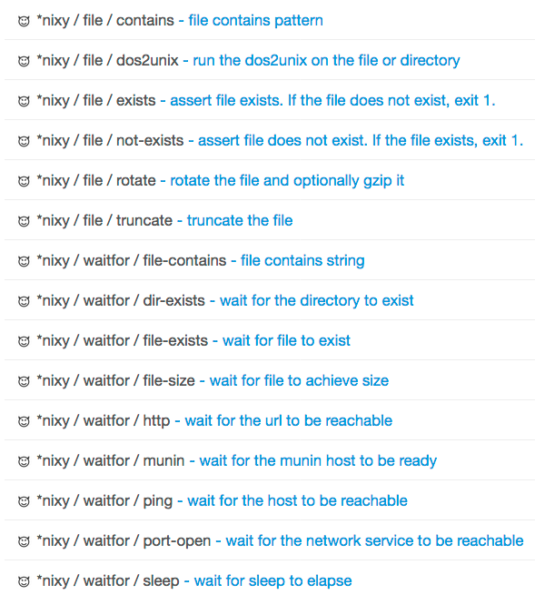

# nixy-step-plugins

A set of step plugins for unixy Nodes. 

These step plugins provide a set of utilities supporting several common use cases.

They are written in bash and depend on ubiquitous unix commands like `curl`.

You can also use this project as a good example of how to write your own step plugins
in shell script.

## Build and install

To "build" the plugin, you just need to run the `build.sh` script.

```
$ ./build.sh
.
. output omitted
.
$ ls build/dist/
nixy-file-1.0.0.zip	nixy-waitfor-1.0.0.zip
```

Copy the zip files inside build/zip to $RDECK_BASE/libext.

After install you should see these as Node Steps in the job editor.



