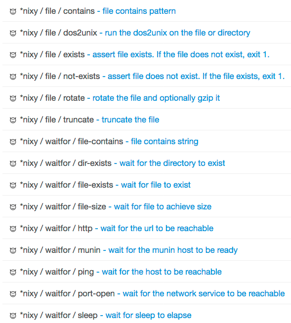

# nixy-step-plugins

A set of step plugins for unixy Nodes. 

These step plugins provide a set of utilities supporting several common use cases.

They are written in bash and depend on ubiquitous unix commands like `curl`.

You can also use this project as a good example of how to write your own step plugins
in shell script.

## Build and install

To "build" the plugin, you just need to run the `build.sh` script.

```
$ ./build.sh
.
. output omitted
.
$ ls build/dist/
nixy-file-1.0.0.zip	nixy-waitfor-1.0.0.zip
```

Copy the zip files inside build/zip to $RDECK_BASE/libext.

After install you should see these as Node Steps in the job editor.



## Publishing to Maven Central

Artifacts are published to Sonatype and Maven Central (group `org.rundeck.plugins`). The release workflow can publish when the required secrets are configured.

**Required project properties (for local publish or CI):**

- `signingKey` – base64-encoded GPG private key for artifact signing
- `signingPassword` – passphrase for the GPG key
- `sonatypeUsername` – Sonatype Nexus username (or token user)
- `sonatypePassword` – Sonatype Nexus password (or token)

**Publish command:**

```bash
./gradlew -PsigningKey="<base64 key>" -PsigningPassword="..." \
  -PsonatypeUsername="..." -PsonatypePassword="..." \
  publishToSonatype closeAndReleaseSonatypeStagingRepository
```

In CI, configure the repository secrets `SONATYPE_USERNAME`, `SONATYPE_PASSWORD`, `SIGNING_KEY`, and `SIGNING_PASSWORD`; the release workflow will publish to Maven Central when these are set.

